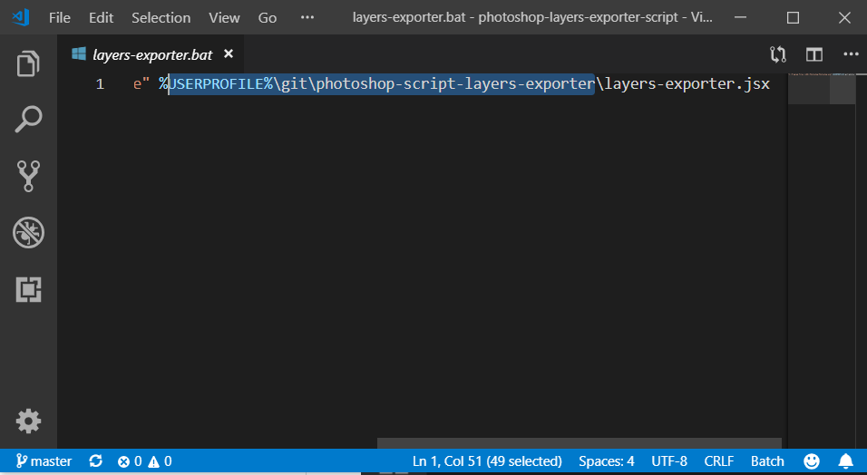

PHOTOSHOP-SCRIPT-LAYERS-EXPORTER
===

Photoshop script to export layer from project to PNG images.

Usage: exporting sketch to character animation, mock-up, code.

# Getting started

* Clone this reposity
* Edit `output` value in `layers-exporter.jsx` with your user folder
* Edit `layers-exporter.bat` to target your local path to `layers-exporter.jsx`

# Usage

* Open test photoshop file `./test/character.psd`
* Execute `layers-exporter.bat`
* Get your results from the same `output` folder as configured before

# Example

