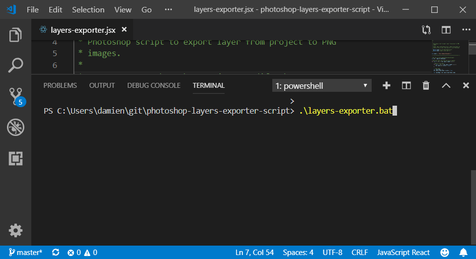

PHOTOSHOP-SCRIPT-LAYERS-EXPORTER
===

Photoshop script to export layer from project to PNG images.

Usage: exporting sketch to character animation, mock-up, code.

# Getting started

* Clone this reposity
* Open test photoshop file `./test/character.psd`
* Execute `layers-exporte.bat`
* Get your results from your `Documents` folder

NOTE: Edit `output` value in `layers-exporte.jsx` if you want to change the target folder

# Example

